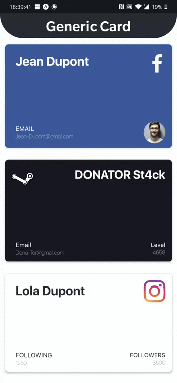

## GenericRoundedCard
Generic Rounded Card is a module that displays a look-a-like a Card that you can Custom as you want in your react native view !

See few example in the following gif:



Inspriation from @medipass (https://github.com/medipass/react-native-health-card)

Leave a Star if you like this component.
_______________________________

## Characteristics

* The module allow you to create a rounded Card with the color that you choose.
* The module allow you to add a Thumbnail(picture url or picture in your repository) where you want (corner of the card)
* The module allow you to add two different method of text where you want (corner of the card) 
  * Title only.
  * Title + Text under the title. <br/>


## Usage 

This is my first component, I don't know if he can be really useful for user to be a npm module then you need to add my file in your repository to use it.

* Go the root folder and download the file with the name "genericRoundedCard.js" and the font as well.
* Add it to your repository. (usually in the components folder for the js file and assets/font/ for the fonts)
* Import it. ` import {GenericRoundedCard} from "[path_to_the_location_of_the_file]/genericRoundedCard"' `
* Use it with the available props. 


## Example

To run the example in the `example/` folder:

- Ensure you have `react-native` && `expo` installed globally.

1. `cd example/`
2. `npm install`
3. `yarn start`

```javascript
import {GenericRoundedCard} from "./components/genericRoundedCard";

...
<GenericRoundedCard
	fontTopLeftCornerTitle={"SnapFontBold"}
	contentTopLeftCornerTitle={'Jean Dupont'}
	colorTopLeftCornerTitle={"white"}
	sizeTitleTopLeftCorner={32}

	thumbnailTopRightCorner={'shorturl.at/uP678'}
	formatPictureTopRightCorner={'square'}

	fontBottomLeftTitle={"SnapFont"}
	fontBottomLeftText={"SnapFontLight"}
	contentBottomLeftTitle={"EMAIL"}
	contentBottomLeftText={'Jean-Dupont@gmail.com'}
	colorBottomLeftTitle={"white"}
	colorBottomLeftText={"white"}
	sizeTitleBottomLeft={16}
	sizeTextBottomLeft={16}

	thumbnailBottomRightCorner={'shorturl.at/byDGH'}
	formatPictureBottomRight={'circle'}

	backgroundColorCard={"#3b5998"}
/>
...
```

Property	Type	Default	Description

## Available Props

| Property | Type | Default | Description
| :---         |     :---:      |  :---:        |       :---:   |
| #### | #### | #### | #### |
| Top left Corner --> | #### | #### | #### |
| #### | #### | #### | #### |
| thumbnailTopLeftCorner | string | undefined | this is the field to add your url to a thumbnail that you want to show | 
| formatPictureTopLeftCorner | string ('square', 'circle') | square | This is the format of your thumbnail, in square format or crop in circular format like facebook profile picture|
| fontTopLeftCornerTitle | string (see font part below) | default system font | font of your title or text that you want to show|
| fontTopLeftCornerText | string (see font part below) | default system font | font of your title or text that you want to show|
| contentTopLeftCornerTitle | string | undefined | Your string that you want to print |
| contentTopLeftCornerText | string | undefined | Your string that you want to print |
| sizeTitleTopLeftCorner | number | undefined | The size of your string |
| sizeTextTopLeftCorner | number | undefined | The size of your string |
| colorTopLeftCornerTitle | string ("white", "#ffff") | undefined | The color of your string |
| colorTopLeftCornerText | string ("white", "#ffff") | undefined | The color of your string |
| #### | #### | #### | #### |
| Top Right Corner --> | #### | #### | #### |
| #### | #### | #### | #### |
| thumbnailTopRightCorner | string | undefined | this is the field to add your url to a thumbnail that you want to show |
| formatPictureTopRightCorner | string ('square', 'circle') | square | This is the format of your thumbnail, in square format or crop in circular format like facebook profile picture|
| fontTopRightCornerTitle | string (see font part below) | default system font | font of your title or text that you want to show|
| fontTopRightCornerText | string (see font part below) | default system font | font of your title or text that you want to show|
| contentTopRightCornerTitle | string | undefined | Your string that you want to print |
| contentTopRightCornerText | string | undefined | Your string that you want to print |
| sizeTitleTopRightCorner | number | undefined | The size of your string |
| sizeTextTopRightCorner | number | undefined | The size of your string |
| colorTopRightCornerTitle | string ("white", "#ffff") | undefined | The color of your string |
| colorTopRightCornerText | string ("white", "#ffff") | undefined | The color of your string |
| #### | #### | #### | #### |
| Bottom Left Corner --> | #### | #### | #### |
| #### | #### | #### | #### |
| thumbnailBottomLeftCorner | string | undefined | this is the field to add your url to a thumbnail that you want to show |
| formatPictureBottomLeft | string ('square', 'circle') | square | This is the format of your thumbnail, in square format or crop in circular format like facebook profile picture|
| fontBottomLeftTitle | string (see font part below) | default system font | font of your title or text that you want to show|
| fontBottomLeftText | string (see font part below) | default system font | font of your title or text that you want to show|
| contentBottomLeftTitle | string | undefined | Your string that you want to print |
| contentBottomLeftText | string | undefined | Your string that you want to print |
| sizeTitleBottomLeft | number | undefined | The size of your string |
| sizeTextBottomLeft | number | undefined | The size of your string |
| colorBottomLeftTitle | string ("white", "#ffff") | undefined | The color of your string |
| colorBottomLeftText | string ("white", "#ffff") | undefined | The color of your string |
| #### | #### | #### | #### |
| Bottom Right Corner --> | #### | #### | #### |
| #### | #### | #### | #### |
| thumbnailBottomRightCorner | string | undefined | this is the field to add your url to a thumbnail that you want to show |
| formatPictureBottomRight | string ('square', 'circle') | square | This is the format of your thumbnail, in square format or crop in circular format like facebook profile picture|
| fontBottomRightTitle | string (see font part below) | default system font | font of your title or text that you want to show|
| fontBottomRightText | string (see font part below) | default system font | font of your title or text that you want to show|
| contentBottomRightTitle | string | undefined | Your string that you want to print |
| contentBottomRightText | string | undefined | Your string that you want to print |
| sizeTitleBottomRight | number | undefined | The size of your string |
| sizeTextBottomRight | number | undefined | The size of your string |
| colorBottomRightTitle | string ("white", "#ffff") | undefined | The color of your string |
| colorBottomRightText | string ("white", "#ffff") | undefined | The color of your string |


## FONT available 

* Roboto ` require("./../assets/fonts/Roboto.ttf"),`
* Roboto_medium ` require("./../assets/fonts/Roboto_medium.ttf"), `
* GenericRoundedCardNormal ` require("./../assets/fonts/SF-UI-Text-Regular.otf"), `
* GenericRoundedCardLight ` require("./../assets/fonts/SF-UI-Display-Ultralight.otf"), `
* GenericRoundedCardBold ` require("./../assets/fonts/SF-UI-Display-Bold.otf") `

You need to copy them and add to your project (change the path if their are not where I wrote). 

Thank you.
